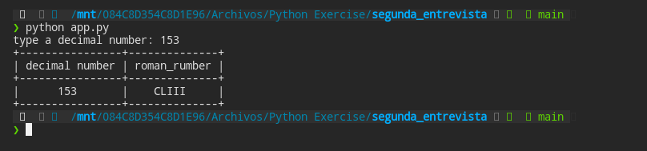
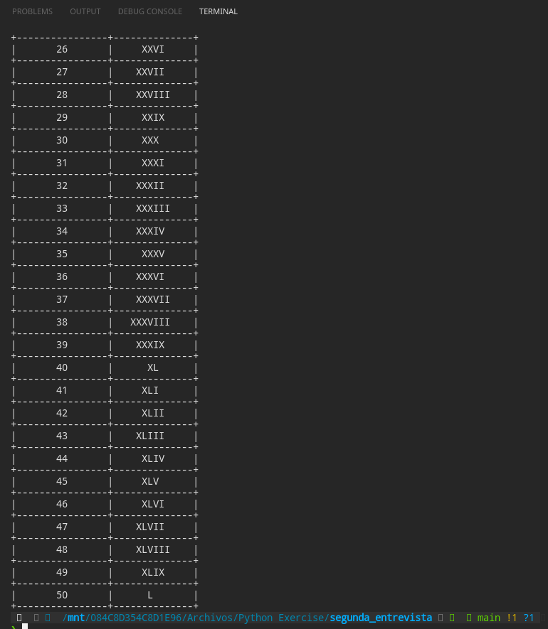

# Ejercicio Entrevista

## Función

- Este programa pide que ingreses un número decimal, despues de ello, te va a regresar el número equivalente en romano
- Si tu no ingresas el numero decimal, va a imprimir los números del 1 al 50 en decimal y su equivalente en romano
- La impresión se realiza en una tabla 

## Requerimientos

Los modulos utilizados se encuentran en el archivo requirements.txt

## Instalación 
```
pip install -r requirements.txt
```

## Output
Resultado de la impresión de nuestro número ingresado



Resultado de la impresión si no ingresamos un número

